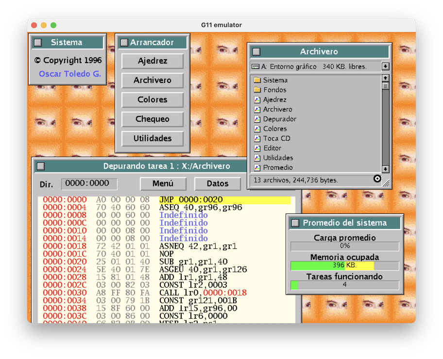
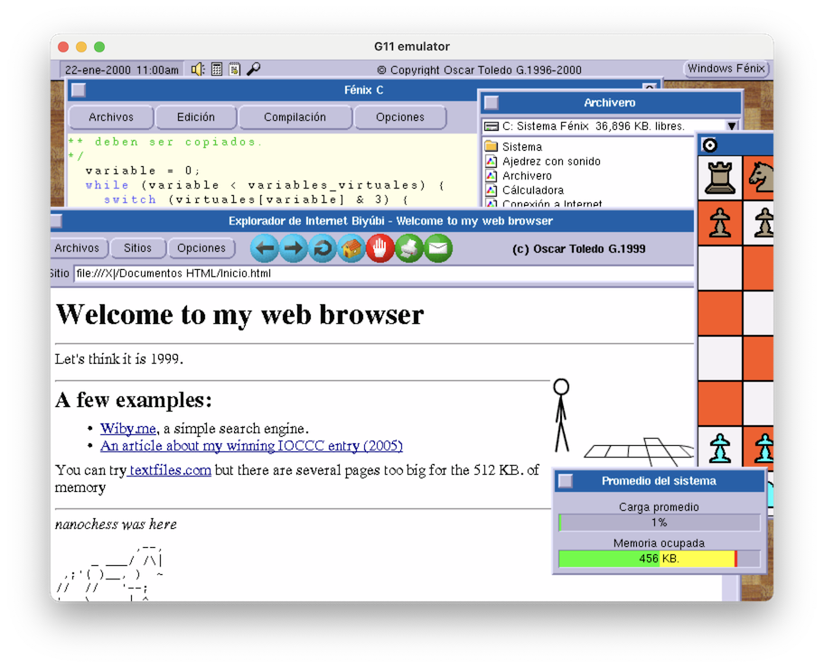

# G11 computer emulator (Am29000)

### by Oscar Toledo G. [https://nanochess.org/](https://nanochess.org/)

Once upon a time in the mysterious lands of Mexico, in Fall 1996 and through Spring 1997, I coded a 32-bit windowed operating system in machine code, fit it into a floppy, and jumped in excitement as it boot up and I could do things.

Of course, I knew it was a great thing because you couldn't boot Windows 3.1 or GEM from a floppy disk, but I was very far from knowing how so cool it was. Unfortunately, not a thing I could give away for everyone to see, as it was written for a homebrew computer based on the AMD Am29000 processor.

A full article about this operating system is available at [https://nanochess.org/the_am29000_computer.html](https://nanochess.org/the_am29000_computer.html)

There is now a Javascript emulator runnable at [https://nanochess.org/am29000_emulator.html](https://nanochess.org/am29000_emulator.html)

I restored most of my backups from 1999, and now you can see my development environment, C compiler, assembler, some games, a printed circuit board editor, an early desktop publishing application, and a web browser. The web browser can connect to Internet (currently only in macOS).

A full article about the C compiler and the web browser is available at [https://nanochess.org/am29000_c_compiler_web_browser.html](https://nanochess.org/am29000_c_compiler_web_browser.html)

## Compiling it

You need libSDL2 for compiling the emulator. Just go to libsdl.org and install the latest libSDL2 for your platform.

    gcc emulator.c am29000.c clgd5429.c -lSDL2 -o emulator

For macOS, you need to create a console Xcode project, add these files, and drag the libSDL2 framework to your source tree. Or simply use my XCodeProj file.

For Windows you can use Visual C++ Studio Express 2008 or 2010.

## Releases

I've prepared two precompiled releases for Windows and macOS 15 and higher. You can find these in the Releases tab.

The Javascript release can be found in the _js_ directory.

## Using it (1997 version)

If everything goes right, you should see a blue screen, and then drag&drop the _disk.img_ file I've provided into the window. The operating system should boot up immediately, I didn't add delays for disk access.

In the Javascript version the disk is preloaded automatically. In both version you should wait a few seconds while the OS builds fonts for the system.

That's it, you can play moving the windows, clicking the buttons to access the programs, one of these Archivero will allow you to see the full filesystem. If you do right-click on the window around the buttons, you'll change the color scheme.

* Archivero: The file manager. You can drag&drop files between windows.
* CDROM: This enables a ISO-9660 file system, but there's no CD support in the emulator.
* Circuito impreso: A demo of vectorial graphics.
* Colores: A way to edit the operating system colors.
* Depurador: A bare bones debugger where you can view dumps of memory or disassembled code. You can click on a line and enter Am29000 assembler mnemonics, don't forget to press Enter to input it.
* Editor: A text editor that can print documents (very glitchy)
* Promedio: Processor usage and free memory.
* Terminal: A serial terminal, but there's no serial port support.
* Tipografia: Font faces tester and it can also change operating system ones.
* Utilidades: The trash to drop files, or to bring new folders.
* The folder Fondos contains background pictures, click any to enable it.
* The folder Sistema/Protectores de pantalla contains a single screensaver called Acuario, the graphics are based on XFishtank.

## Using it (1999 version)

You need to drag & drop the _harddisk_master.img_ file in the center of the window. The operating boots up immediately. You can drop further disk images, and these will appear as A: drive.

The date is shown at the top-left corner of the screen (click it to change the date), there are four fixed icons: Volume (not working), Calculator, System Status, and change screen resolution (not working). On the top-right corner of the screen is a button for displaying a fixed menu of programs. You can double-click title bars to minimize windows.

The only working programs are Ajedrez, Archivero, Fénix C, Circuito Impreso, Publivisión, and Bloques (just compile it from source using Fénix C)

You can also print source code to any of the supported printers. You need to configure the printing for Fénix C in Opciones-Impresión. I already put some free fonts (located in Sistema/Tipos de letra). 

The source code for the C compiler and the assembler are in the Entorno de Desarrollo folder. Did you notice I recommended drag&drop the hard disk image in the center of the window? If you want to recompile the C compiler or the assembler, you need extra memory (disabling the web browser), to do this drag&drop the hard disk image file into the bottom-right corner of the emulator window (use the Promedio utility to see the free memory). It is pretty amazing to watch the 10,203 lines of source code being compiled and getting exactly the same binary.

Publivisión is almost the first working version from the last day of 1998, so it is filled with bugs, anyway you can create documents with it and print them. This early application already runs at 10,000 lines of source code.

Circuito Impreso is my PCB editor and it is the most polished application at the time. It is pretty easy to use, just experiment with left click (draw) and right click (select). The credits image was scanned from an AMD manual cover. There are a few bugs in the display driver when moving items, but I'll correct it later.

To run the web browser, open a file browser (Archivero), and click in Explorador de Internet. I also put the source code to my very first browser (more like a viewer), and I don’t know if it can be compiled, but probably it would need some changes. The browser can connect to Internet if you run it on a macOS, so you can experience it like in 1999. I still need to code the Sockets portion for Windows.

Another thing you’ll notice in the web browser, I’m still not emulating the Am29050 processor, and the JPEG library depends a lot on the multiplication instruction, so it is incredibly slow for displaying JPEG images. It is so 1999! 

## Printing

The prints generated by the operating system can work with a real printer if you can find an HP Laserjet IIP, Canon BJC-600 or Epson Stylus 600. BTW, you can read the HP PCL5 generated with [https://www.coolutils.com/online/PCLViewer](https://www.coolutils.com/online/PCLViewer) or [http://redtitan.org](http://redtitan.org)

When you are printing the cursor will move slowly because the printer task is working in the background, be sure to close the window only when the cursor moves fast again.

The print files are generated in your Documents folder with the name _printer001.txt_ and you need to close the emulator in order to use this file.

Please notice that the Javascript version of the emulator currently doesn't generate the print files, and only has the 1997 ROMs.

When you exit the operating system by closing the Arrancador window (or through the _Salir del Sistema_ option in the 1999 version), it will create a full dump of the 512K RAM both as hexadecimal and disassembly.

As this operating system was written in machine code, there is no source like that. The machine code is the source, and some notes I took (a few are in my article).
